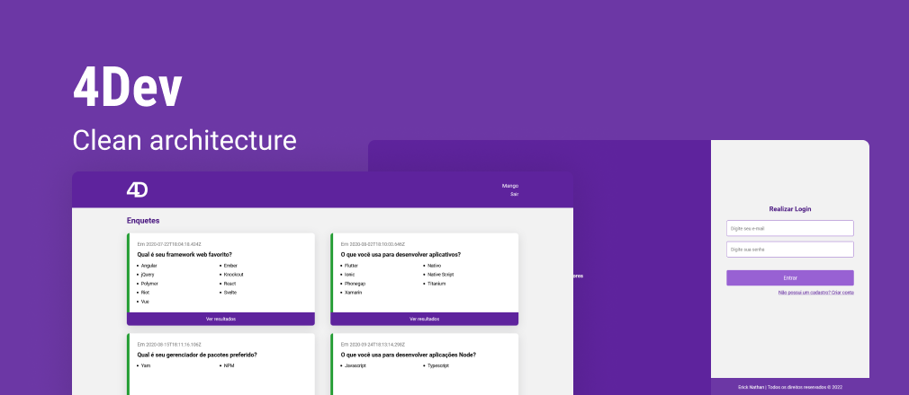

<h1 align="center">
  
</h1>

  <a href="#-tecnologias">Tecnologias</a>&nbsp;&nbsp;&nbsp;|&nbsp;&nbsp;&nbsp;
  <a href="#-projeto">Projeto</a>&nbsp;&nbsp;&nbsp;|&nbsp;&nbsp;&nbsp;
  <a href="#-como-executar">Como executar</a>&nbsp;&nbsp;&nbsp;|&nbsp;&nbsp;&nbsp;
  <a href="#-licença">Licença</a>

 

  

## ✨ Tecnologias

Esse projeto foi desenvolvido com as seguintes tecnologias:

- [React](https://reactjs.org)
- [React Router DOM](https://reactrouter.com/en/main/)
- [Cypress](https://www.cypress.io/)
- [Jest](https://jestjs.io/pt-BR/)
- [Axios](https://axios-http.com/)
- [TypeScript](https://www.typescriptlang.org/)
- [Sass](https://sass-lang.com/)
- [Webpack](https://webpack.js.org/)

## 💻 Projeto

O 4Dev é uma aplicação de rede social para registro de questionários, incluindo funcionalidades para sintetização de conhecimentos em React com Typescript e Hooks, utilizando TDD, Clean Architecture, Design Patterns e SOLID.

## 🚀 Como executar

- Clone o repositório
- Instale as dependências com `yarn`
- Inicie a aplicação web com `yarn start:dev`

Agora você pode acessar [`localhost:8080`](http://localhost:8080) do seu navegador.

## 📄 Licença

Esse projeto está sob a licença MIT. Veja o arquivo [LICENSE](LICENSE.md) para mais detalhes.

---

Feito com ♥ por Erick Nathan durante o programa de formação [ReactJS, Hooks, Recoil, TDD, Clean Architecture, SOLID](https://www.udemy.com/course/react-com-mango/) promovido pelo [Rodrigo Manguinho](https://www.udemy.com/course/react-com-mango/#instructor-1)
